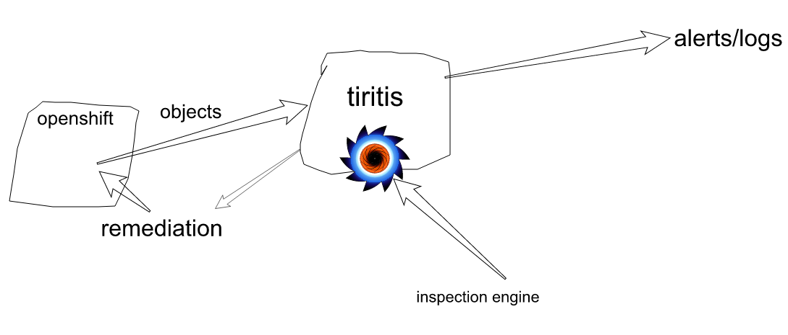

# tiritis
τηρητής

### License

Logo is taken from here: https://pixabay.com/en/gnu-animal-cute-funny-mammal-161339/


### How?

#### Inspections

Do not allow route without TLS:
```javascript
if ((e.type==='ADDED')  && (typeof(e.object.spec.tls)==='undefined')){
  alert('Route wihtout TLS not allowed in "' + e.object.metadata.namespace + ":" + e.object.metadata.name+'"');
}
```

Check for privileged in SCC:
```javascript
if (e.object.allowPrivilegedContainer){
  alert("Security context constraints allows creating privileged containers: " + e.object.metadata.name);
}
```